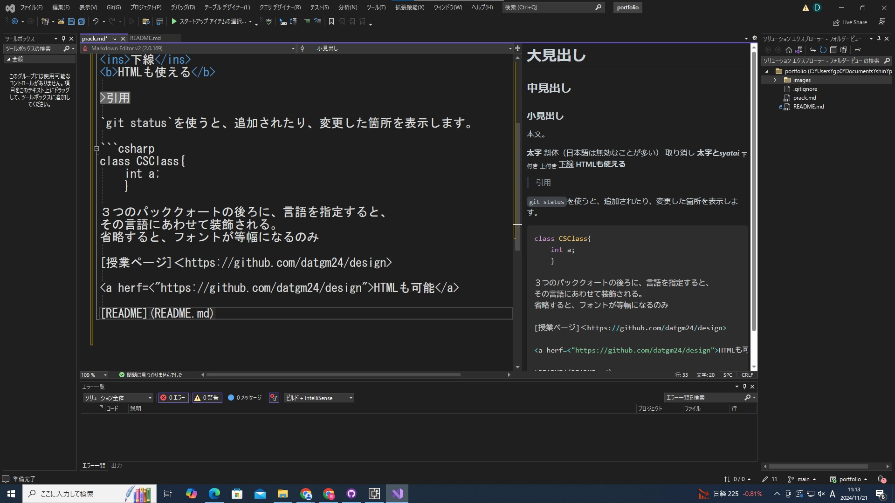

# 大見出し
## 中見出し
### 小見出し

本文。

**太字**
*斜体*（日本語は無効なことが多い）
~~取り消し~~
**太字と**___syatai___
<sub>下付き</sub>
<sub>上付き</sub>
<ins>下線</ins>
<b>HTMLも使える</b>

>引用

`git status`を使うと、追加されたり、変更した箇所を表示します。

```csharp
class CSClass{
    int a;
    }

３つのパッククォートの後ろに、言語を指定すると、
その言語にあわせて装飾される。
省略すると、フォントが等幅になるのみ

[授業ページ]<https://github.com/datgm24/design>

<a herf=<"https://github.com/datgm24/design">HTMLも可能</a>

[README](README.md)




- ジョージワシントン
- ジョンアダムズ
- トーマスジェファーソン

1.数字リスト
2.数字リスト2
3.数字リスト3

-レベル1
 -レベル2
  -レベル3

1.数字
　i.数字2
      a.数字3

-[ ] タスク
-[ ] チェックリスト
-[x] できたらxを入力


- :+1:サムアップ

　:smiley:

:link:[README] (README.md)

あいうえお。

かきくけこ。

段落は、1行空ける。